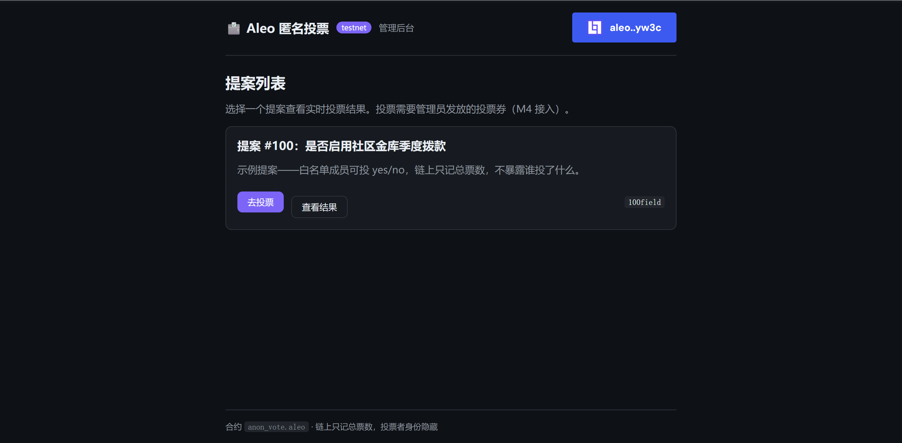
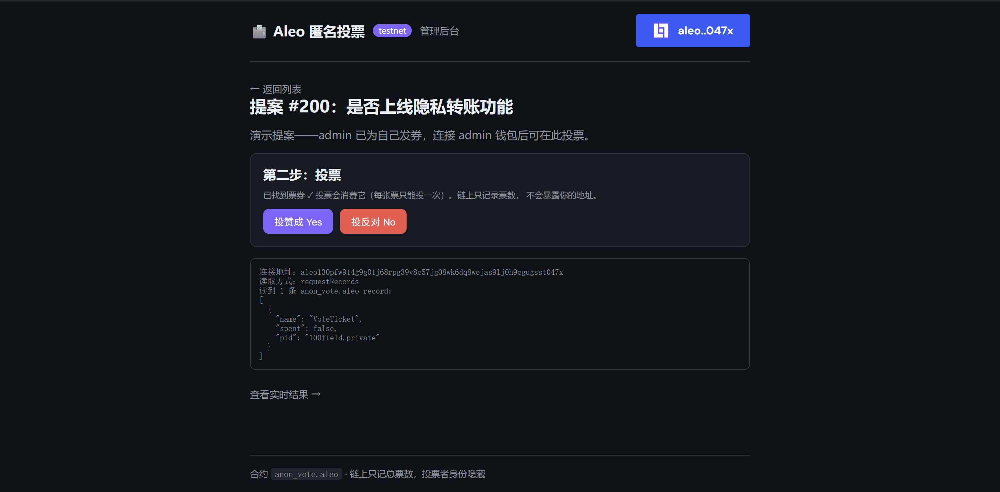
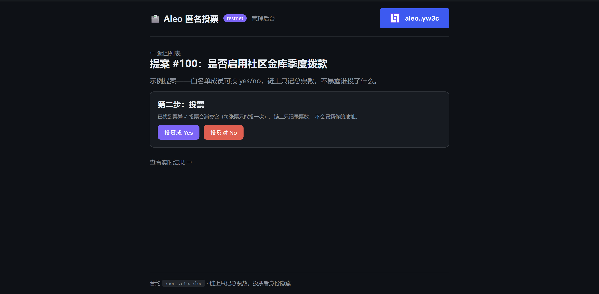
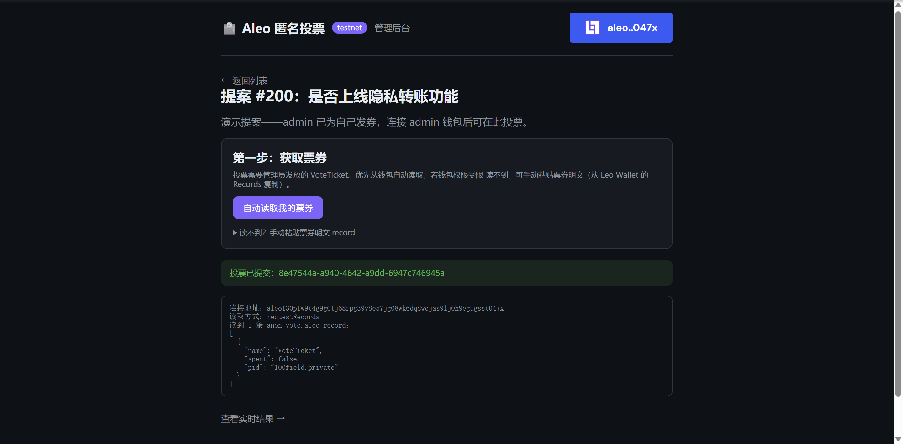

# Task 3 - 建起来：从程序到 dApp

基于 Leo + 前端完成的可交互隐私小应用：**Aleo 匿名投票 dApp**。

## 项目

- **仓库（完整代码）**：https://github.com/0xSen10/aleo-anon-vote
- **合约**：`anon_vote.aleo`，已部署到 Aleo testnet
- **部署 tx**：`at1yrf4khlwregqhyd0wxyts2nd3g9pe6yq0gnkv93ea9xvhekv9srqkjst0a`

## 做了什么

白名单成员对提案投 yes/no，**链上只能看到总票数，看不到谁投了什么**。投票者身份通过 Aleo 的 record 模型 + nullifier 天然隐藏。

- admin 给白名单地址发放 `VoteTicket`（record）
- voter 用 ticket 投票，`vote_yes/vote_no` 把 ticket 作为 **private 输入消费**，链上只留 nullifier
- 总票数走 public `mapping`，公开可查

## 隐私模型（诚实说明）

| 信息 | 是否公开 |
|------|---------|
| 投票者身份 | **隐藏 ✅**（record + nullifier） |
| 总票数 | 公开（产品要展示的） |
| 白名单地址 | 公开（issue_ticket 是公开调用） |
| 单笔选择 | 可被 tally diff 推断，但**关联不到地址** |

## 合约接口（Leo 4.0.2）

| 函数 | 作用 |
|------|------|
| `init(admin)` | 设定管理员（仅一次） |
| `open_proposal(pid)` / `close_proposal(pid)` | admin 开/关提案 |
| `issue_ticket(voter, pid)` | admin 发券（防重复发券） |
| `vote_yes(ticket)` / `vote_no(ticket)` | 持券人投票，消费 ticket → nullifier 防双投 |

## 技术栈

- **合约**：Leo 4.0.2，部署 Aleo testnet
- **前端**：Vite + React 18 + TypeScript
- **钱包**：Leo Wallet（`@demox-labs/aleo-wallet-adapter`）
- **读链上状态**：直接 fetch Provable explorer REST API（不需要重型 WASM SDK）
- **发交易**：经 Leo Wallet `requestTransaction`，证明在插件侧生成

## 链上验证

经 Leo Wallet 完整跑通投票闭环，**真实投出一票并上链确认**：

```
tally_yes[100field]  = 1
votes_cast[100field] = 1
```

（投票者地址未上链 —— 隐私属性成立）

## Demo 截图

### 1. 首页提案列表（钱包已连接）


### 2. 读取票券（requestRecords 从钱包读到 VoteTicket）


### 3. 投票（找到票券，投 Yes/No）


### 4. 投票已提交


## 运行

```bash
# 合约
cd contract && leo build && leo deploy --broadcast --network testnet

# 前端
cd frontend && npm install && npm run dev   # http://localhost:5173
```

详见仓库 README：https://github.com/0xSen10/aleo-anon-vote
