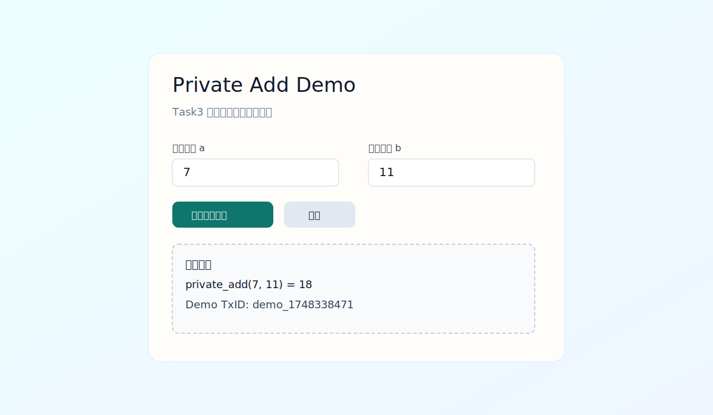

# Task 3 - 建起来：从程序到 dApp

## 项目名称
Leo Real Execution Demo（真实执行版私密加法）

## 这次不是前端假 demo
本作业前端不会在浏览器里直接做 `a+b` 冒充链上执行。执行路径是：

1. 前端提交参数到本地后端；
2. 后端调用 Leo CLI：`leo run private_add <a>u32 <b>u32`；
3. 把 Leo 真实执行输出返回前端展示。

因此这是“真实 Leo 程序执行 + 前端交互”的最小项目。

## 目录结构
```text
task3/
├── backend/
│   └── server.js
├── leo/
│   ├── private_calc.leo                # 说明用简版代码
│   └── private_calc/
│       ├── program.json
│       └── src/main.leo                # Leo CLI 实际执行的项目
├── web/
│   └── index.html
├── demo-screenshot.svg
└── task3.md
```

## 核心 Leo 程序
文件：`leo/private_calc/src/main.leo`

```leo
program private_calc.aleo {
    transition private_add(a: u32, b: u32) -> u32 {
        let result: u32 = a + b;
        return result;
    }
}
```

## 前端功能
文件：`web/index.html`

- 配置后端地址（默认 `http://127.0.0.1:8787`）
- 检查后端健康状态
- 输入 `a`、`b` 后调用真实接口执行 Leo
- 展示执行结果、stdout、stderr

## 后端功能
文件：`backend/server.js`

- `GET /health`：检查后端和 Leo 项目路径
- `POST /api/private-add`：执行 `leo run private_add ...` 并返回结果

## 本地运行步骤
### 1) 安装 Leo CLI（如果未安装）
先确保命令可用：

```bash
leo --version
```

### 2) 启动后端
在 `task3` 目录执行：

```bash
node backend/server.js
```

看到 `listening on http://127.0.0.1:8787` 即表示启动成功。

### 3) 打开前端
直接用浏览器打开：

`task3/web/index.html`

先点“检查后端”，再点“真实执行 Leo”。

## Demo 截图
- `demo-screenshot.svg`


